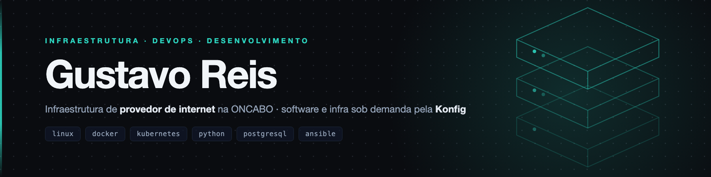

Opero infraestrutura e escrevo o software que roda em cima dela.

Sou Supervisor de Suporte e NOC na **ONCABO**, provedor de internet, onde respondo pela operação da rede — GPON, roteamento, autenticação, telefonia e monitoramento — e pelos painéis que a equipe usa para operar. Pela **Konfig** presto serviço em infraestrutura e desenvolvimento: administro Linux, subo container e virtualização, publico aplicação do domínio ao deploy e escrevo a aplicação em si, do banco à API.

### Atuação

**Infraestrutura** — Linux em produção, Docker e Kubernetes, virtualização em Proxmox e VMware, Nginx e Traefik como proxy reverso, DNS, SSL e Cloudflare, observabilidade com Grafana, Prometheus e Zabbix.

**Redes e telecom** — rede de provedor: GPON e OLT, PPPoE/IPoE, roteamento, TR-069/GenieACS, SIP e Asterisk, diagnóstico e troubleshooting.

**Desenvolvimento** — Python e FastAPI, TypeScript e Node, React e Next.js, PostgreSQL. Automação de processo, integração entre sistemas e ferramentas internas de operação.

**IA aplicada** — integração de LLM em aplicação, agentes que executam tarefa, RAG sobre base própria e servidores MCP (Model Context Protocol).

Stack em texto

**Infraestrutura** — Linux (Debian, Ubuntu, CentOS) · Docker e Compose · Kubernetes (RKE2, Rancher, MetalLB, Sealed Secrets) · Ansible · Proxmox · VMware ESXi · Coolify · Nginx · Traefik · Cloudflare · Windows Server (IIS, Apache, Tomcat, Samba, Active Directory)

**Redes e telecom** — TR-069 / GenieACS · Asterisk e Issabel · SIP · SNMP · Mikrotik · pfSense · DNS (Bind) · WireGuard · OpenVPN · TCP/IP

**Segurança** — nftables · Fail2Ban · CrowdSec · hardening de SSH · gitleaks · gestão de segredos · perícia forense de servidor comprometido

**Observabilidade** — Grafana · Prometheus · Loki e Promtail · GlitchTip / Sentry · Zabbix · cAdvisor e exporters

**Bancos de dados** — PostgreSQL · MySQL · MongoDB · Redis · ClickHouse · SQLite. Modelagem, tuning, FDW, réplica, migração entre versões e auditoria de triggers e functions.

**Linguagens** — Python · TypeScript · JavaScript · C# · SQL / PL-pgSQL · PHP · Bash · Java · Swift

**Backend** — FastAPI · Flask · ASP.NET Core · Entity Framework Core · Laravel · Spring Boot · Node.js · Fastify · SQLAlchemy · Alembic · Pydantic · Celery · RabbitMQ · Socket.IO · APScheduler

**Frontend** — React · Next.js · Vite · Bun · Tailwind CSS · shadcn/ui · MUI · TanStack Query · React Hook Form · Zod · Recharts · Streamlit

**Ferramentas** — Git · GitHub Actions · CI/CD · pre-commit · pytest · Vitest · Postman · MCP (Model Context Protocol) · Jasper Reports · QuestPDF · WeasyPrint

### Atividade

[LinkedIn](https://linkedin.com/in/gustsr) &nbsp;·&nbsp; [gustavo.sil.reis@gmail.com](mailto:gustavo.sil.reis@gmail.com)
